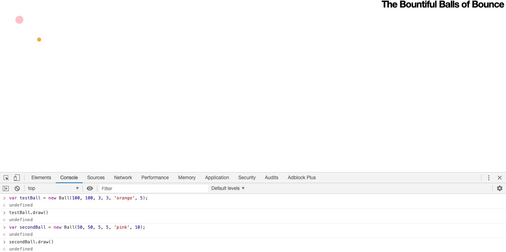
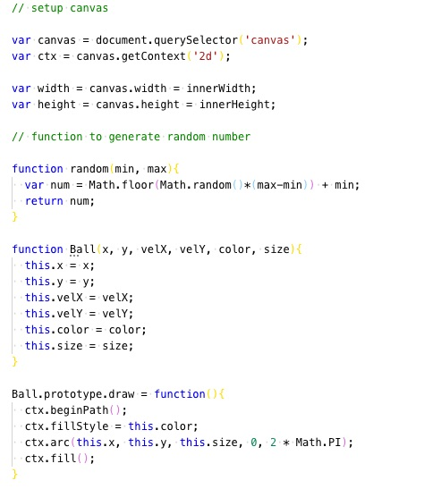

## Approach

Writing a JavaScript function to create and draw a static ball.

**Static ball on Canvas**

**Code Snippet**

**Adding animation to the balls**

**Balls changing colour on collision**

